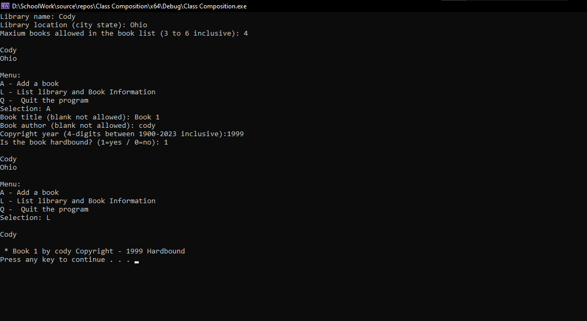

# Class Composition Project

This project was created for my CSIS 212 course to demonstrate class composition and object-oriented programming in C++.

The program allows the user to create a library, add books to the library, and display stored book information through a menu-driven console application.

## Features

* Library and Book classes
* Class composition using a vector of Book objects
* Constructors and getters/setters
* Menu-driven user interaction
* Input validation
* Book listing and sorting functionality

## Files Included

* `main.cpp` – Main program and menu system
* `Library.h / Library.cpp` – Library class implementation
* `Book.h / Book.cpp` – Book class implementation

## Technologies Used

* C++
* Visual Studio
* Vectors
* Object-oriented programming
* Class composition

## Example Output

The program allows users to:

* create a library
* add books
* store author and copyright information
* display book information from the library

## What I Learned

This project helped me better understand how classes work together through composition. I also practiced working with vectors, constructors, validation, and organizing code across multiple source and header files.

## Notes

This project was completed as part of a class assignment for CSIS 212.

## Program Output

